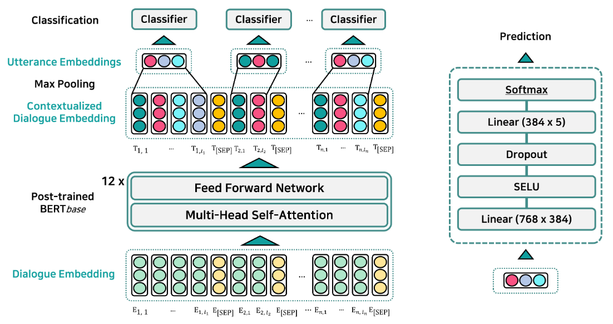

# EmotionX-KU: BERT-Max based Contextual Emotion Classifier

### Model Description

Our paper is available at https://arxiv.org/pdf/1906.11565.pdf

### Acknowledgements

This work was supported by Institute for Information & communications Technology Promotion (IITP) grant funded by the Korea government (MSIT) (no. 2016-0-00010-003, Digital Centent InHouse R&D)
